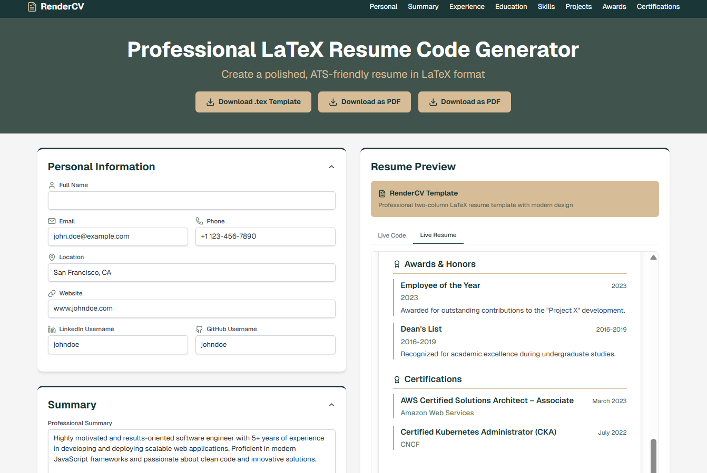

# RenderCV: Professional LaTeX Resume Code Generator

**RenderCV** is a powerful web application designed to help you create polished, ATS-friendly resumes in LaTeX format with ease. Say goodbye to tedious manual formatting and hello to professionally structured resumes ready for your job applications.

### Live - [Click Live Web-Site](https://render-cv.vercel.app/)


### ScreenShot


## ✨ Features

* **Intuitive Form Interface:** Easily input your personal information, summary, experience, education, skills, projects, awards, and certifications through a user-friendly form.
* **Live LaTeX Code Preview:** See your LaTeX resume code update in real-time as you fill out the form.
* **Live Resume Preview:** Get an instant visual representation of your resume's layout and content.
* **Dynamic Section Management:** Add, edit, and remove multiple entries for sections like experience, education, skills, projects, awards, and certifications.
* **Download Options:**
    * **Download `.tex` Template:** Get the raw LaTeX code file to use in your preferred LaTeX editor (e.g., Overleaf).
    * **Download as PDF:** Generate and download a compiled PDF version of your resume directly from the application.
* **Copy to Clipboard:** Quickly copy the generated LaTeX code to your clipboard for easy pasting into Overleaf or other LaTeX environments.
* **Responsive Design:** Works seamlessly across desktop and mobile devices.

## 🚀 Technologies Used

* **Next.js 14 (App Router):** For a powerful and efficient React framework.
* **React:** Building the user interface.
* **TypeScript:** For type-safe and robust code.
* **Tailwind CSS:** For rapid and consistent styling.
* **Lucide React:** For beautiful and customizable icons.
* **`@react-pdf/renderer` (or similar):** For client-side PDF generation (if implemented this way).
* **`latex.js` (or a backend LaTeX compiler like `pdflatex`):** For LaTeX compilation to PDF (likely via an API route).

## 🛠️ Installation and Local Setup

1.  **Clone the repository:**
    ```bash
    git clone https://github.com/TusharTalmale/render_cv.git
    cd rendercv-app
    ```
2.  **Install dependencies:**
    ```bash
    npm install
    # or
    yarn install
    ```
3.  **Run the development server:**
    ```bash
    npm run dev
    # or
    yarn dev
    ```
4.  **Open in your browser:**
    Visit `http://localhost:3000` to see the application.

## 📄 API for PDF Generation

RenderCV utilizes a Next.js API route (`/api/generate-pdf`) to handle the conversion of resume data into a PDF. This typically involves:

1.  Receiving `resumeData` via a POST request.
2.  Generating LaTeX code from the `resumeData`.
3.  Compiling the LaTeX code into a PDF (e.g., using a library or a serverless function that runs a LaTeX compiler).
4.  Sending the compiled PDF back to the client.

## 🤝 Contributing

Contributions are welcome! If you have ideas for new features, improvements, or bug fixes, please feel free to:

1.  Fork the repository.
2.  Create your feature branch (`git checkout -b feature/AmazingFeature`).
3.  Commit your changes (`git commit -m 'Add some AmazingFeature'`).
4.  Push to the branch (`git push origin feature/AmazingFeature`).
5.  Open a Pull Request.

## 📜 License

Distributed under the MIT License. See `LICENSE` for more information.

## 📞 Contact

Tushar Talmale - [tushartal2@gmail.com](mailto:tushartal2@gmail.com)

